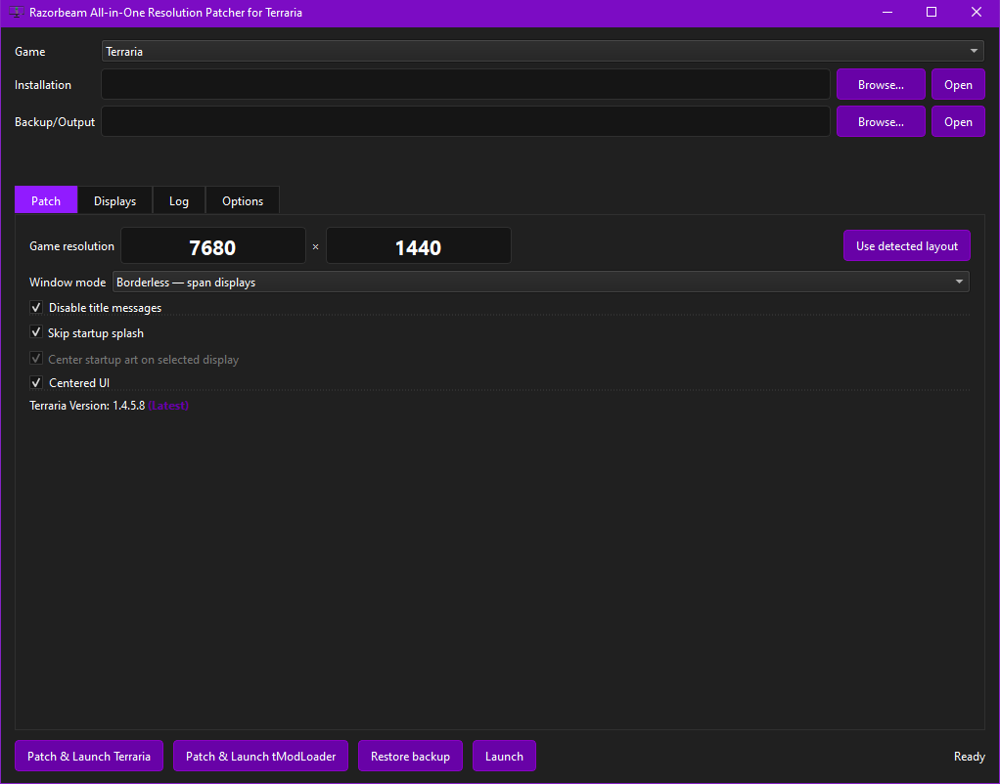
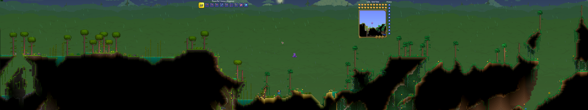
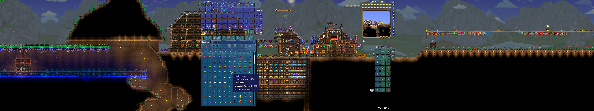

# All-in-One Resolution Patcher for Terraria

<p align="center">
  
</p>

## Highlights
- Easy multi-monitor and widescreen support
- Centered UI so you don't break your neck
- Works with many popular tModLoader mods
- One-click backup/restore
- It just werks™ xdd

# Quick Start Guide
- (easiest) Just click [here](https://github.com/RazorbeamCollectibles/Razorbeam-Terraria-AIO-Resolution-Patcher/releases/download/v1.0.1/RazorbeamTerrariaPatcher.exe).
- Go to [Releases](https://github.com/RazorbeamCollectibles/Razorbeam-Terraria-AIO-Resolution-Patcher/releases), scroll to the bottom, and download any of the .zip files, unzip, and click "LaunchRazorbeamTerrariaPatcher.bat"
- Click Code, Download ZIP, unzip, and click "LaunchRazorbeamTerrariaPatcher.bat"

## Showcase 

### Main Screen


### Examples
Full-resolution triplewide captures. Click either image for the original 7680×1440 view.

[](docs/images/triplewide-world.png)

[](docs/images/triplewide-centered-ui-crafting.png)

---

Other crap:

## Run

Run `LaunchRazorbeamTerrariaPatcher.bat` with Python 3.11 or newer. The launcher creates `.venv` when needed and installs the pinned PySide6 runtime locally.

1. Select **Terraria** or **tModLoader**.
2. Select one or more displays, or enter the resolution and window origin manually.
3. Choose Windowed, Borderless, or Exclusive fullscreen.
4. Configure startup, title, and centered-UI options.
5. Use **Patch & Launch Terraria** or **Patch & Launch tModLoader**.

Backup/output defaults to:

```text
%LOCALAPPDATA%\RazorbeamCollectibles\RazorbeamTerrariaAIORP
```

The field may be changed. If it is blank or invalid, the action is refused and **Use Desktop** appears after the warning animation.

## Display behavior

- Any positive signed 32-bit width and height is accepted. Hardware or driver limits still apply.
- Borderless supports negative desktop coordinates and independent-monitor spans.
- Selecting two displays is allowed; the game image crosses their shared bezel.
- The display map uses physical Windows pixels and Windows Settings connector numbering.
- Display changes trigger an explicit refresh warning.
- Startup splash skipping is available for vanilla Terraria. Splash skipping and title-message suppression are disabled for tModLoader.

## Centered UI

Centered UI places interface layout and hit testing on the selected display while the world and mouse remain available across the full game surface.

Vanilla Terraria receives scoped logical dimensions, mouse translation, UI matrix translation, UI zoom preservation, crafting input support, and full-surface clipping. tModLoader applies the equivalent behavior through runtime hooks, including a scale-aware `Main.UIScaleMatrix` getter hook. The bridge also includes compatibility hooks for SilkyUIFramework and ImproveGame custom input paths. Other mods with custom rendering or input may require additional compatibility work.

Even-numbered monitor groups remain supported. The selected UI display determines placement; the feature is not disabled when a bezel falls at the center of the full span.

## Window behavior

**Keep game visible when focus changes** controls whether a minimized game is restored with `SW_SHOWNOACTIVATE`. The setting does not activate the game or change its Z-order. Its value is embedded in the vanilla patch or tModLoader bridge configuration so direct Steam launches behave like patcher launches.

**Disable title messages** keeps vanilla Terraria titled `Terraria`. This option is unavailable for tModLoader.

Configure the tModLoader display bridge through the desktop patcher. Its in-game config page provides guidance only; display settings are not edited there.

## Backup and restore

Vanilla Terraria uses one verified clean executable backup per installation and game version. Every patch is rebuilt from that clean file. Modified executables are never chained or treated as recovery sources. Configuration state is backed up and restored with the executable.

tModLoader operations back up the existing local bridge, enabled-mod list, bridge configuration, and tModLoader `config.json` before replacement. Other mod files, worlds, players, saves, and Steam Workshop content remain untouched.

Patching and restore refuse to run while the selected game is active. Workers are contained in Windows job objects and cannot terminate unrelated processes. Steam remains responsible for launching and tracking both games.

## Logs and state

Runtime state, rotating logs, backups, and exports live under the configured AppData directory. Shared color schemes live at:

```text
%LOCALAPPDATA%\RazorbeamCollectibles\RazorbeamColorSchemes
```

**Diagnostics mode** adds verbose patch, display, and configuration information to exported logs. **Hide log tab** changes visibility only; logging continues.

No account, updater, telemetry, or patcher network service is used.

## Build and test

Run:

```powershell
scripts\test.ps1
scripts\build.ps1
```

Use `scripts\build.ps1 -OneFile` for the standalone packaging mode. Builds compile `PatchEngine.cs` against the pinned `app\engine\Mono.Cecil.dll`, then package the Python application with PyInstaller. No Terraria or tModLoader binaries are included.

The optional executable integration test accepts `scripts\test.ps1 -TerrariaExe 'path\to\Terraria.exe'`. It operates on a temporary copy.

## Licensing

Project license and third-party notices are in `LICENSE`, `THIRD_PARTY_NOTICES.md`, and `licenses/`.
